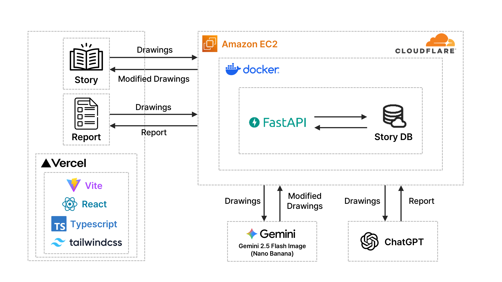

# 🎨 Draw-Mind (SKKU-AI Hackathon)

이 프로젝트는 "제5회 SKKU AI Hackathon"의 '사람 중심의 인공지능 서비스 개발 (Human-centered AI)' 주제로 만들어진 서비스입니다.

이 저장소는 "AI가 사용자의 그림을 해석해 동화(스토리)를 생성하는 웹 애플리케이션"의 프론트엔드와 관련 문서를 포함합니다.

라이브 데모 & 시연
- 시연 영상(YouTube): https://youtu.be/0UD_bNDpvCU

프로젝트 한줄 요약
- Draw-Mind는 사용자가 직접 캔버스에 그린 그림을 AI가 분석해 각 그림에 맞는 짧은 동화(스토리)와 감정 분석 리포트를 생성해주는 사람 중심의 웹서비스입니다. 창작 활동을 통해 자기표현과 감정 인식을 돕는 것을 목표로 합니다.

핵심 기능
- 캔버스 기반 드로잉 인터페이스
- 그림 업로드 및 AI 기반 스토리/이미지 생성
- 단계별 여정(프롤로그 → 5개 스테이지)과 감정 분석 리포트
- 최종 리포트 PDF 내보내기 및 저장/공유

아키텍처 개요 

- 프론트엔드 (React + Vite)
	- 사용자 인터페이스(그리기, 단계 진행, 리포트 보기)
	- `SketchbookCanvas` 컴포넌트에서 그림을 캡처해 base64로 백엔드 전송
	- `audioService` 등 클라이언트 UX 보조 기능

- 백엔드 (별도 서비스)
	- 그림(base64) 수신 → AI 모델(또는 외부 API) 호출 → 결과(합성 이미지, 설명) 반환
	- 세션 기반 처리(session_id)로 다단계 그림을 연결하고 최종 합성 이미지/리포트 생성

- 스토리지 / CDN
	- 생성된 이미지와 정적 자원을 호스팅(배포 환경에서는 CORS 설정 주의)

- 배포
	- 프론트엔드: Vercel (프로덕션 URL 위에 표기된 도메인)
	- 백엔드: 별도 서버(예: AWS, GCP, Azure 등) - API 엔드포인트를 `VITE_API_BASE_URL`로 설정

간단한 흐름 다이어그램

User (Browser)
	→ Draw on Canvas (frontend)
	→ POST base64 image → Backend AI process
	→ Backend returns AI image + description
	→ Frontend shows result → User can export PDF / proceed next stage


## 🚀 기술 스택

- **React 18** + TypeScript
- **Vite** - 빠른 빌드 도구
- **Tailwind CSS** - 스타일링
- **React Router** - 페이지 라우팅
- **HTML5 Canvas** - 그림 그리기
- **Axios** - API 통신

## 📁 프로젝트 구조

```
frontend/
├── src/
│   ├── components/          # UI 컴포넌트
│   │   ├── Layout.tsx
│   │   └── SketchbookCanvas.tsx
│   ├── pages/               # 페이지
│   │   ├── StartPage.tsx
│   │   ├── HomePage.tsx
│   │   ├── DrawingFlowPage.tsx
│   │   └── EmotionAnalysisPage.tsx
│   ├── services/            # API 클라이언트
│   │   ├── api.ts
│   │   └── drawingService.ts
│   └── App.tsx
├── public/
│   └── fonts/               # 한글 폰트
└── vercel.json              # Vercel 배포 설정
```

## 🛠️ 로컬 개발

### 설치 및 실행

```bash
cd frontend
npm install
npm run dev
```

참고: Vite 기본 포트(5173)가 사용 중이면 Vite가 자동으로 다른 포트(예: 5174)를 할당합니다. 터미널 출력을 확인해서 로컬 URL을 열어주세요.

### 빌드

```bash
npm run build
```
---

## 📌 주요 아이디어

- 사용자가 캔버스에서 그림을 그립니다.
- 그 그림은 백엔드 API로 전송되어 AI가 분석하고, 분석 결과를 바탕으로 짧은 동화(스토리)를 생성합니다.
- 완성된 그림과 스토리는 저장·공유·다운로드가 가능합니다.

이 서비스의 핵심은 "사람 중심" 관점에서 사용자가 창작 활동을 통해 감정과 이야기를 표현하도록 돕고, AI가 이를 보조·확장하는 데 있습니다.

---

## 🚀 기술 스택

- 프론트엔드: React 18 + TypeScript, Vite
- 스타일: Tailwind CSS
- 라우팅: React Router
- 캔버스: HTML5 Canvas (custom drawing component)
- HTTP: Axios
- 빌드/배포: Vercel (프론트엔드), 백엔드 별도 운용

---

## 📁 저장소 구조

```
frontend/
├── public/                 # 이미지, 폰트, 정적 자원
├── src/
│   ├── components/         # SketchbookCanvas, Layout 등
│   ├── pages/              # StartPage, HomePage, DrawingFlowPage, EmotionAnalysisPage
│   ├── services/           # API 클라이언트 (drawingService 등)
│   └── main.tsx / App.tsx
└── package.json

README.md (this file)
```
---

## ⚙️ 로컬 개발

1. 레포 클론 후 프론트엔드 디렉터리로 이동

```bash
cd frontend
```

2. 의존성 설치

```bash
npm install
```

3. 개발 서버 실행

```bash
npm run dev
```

참고: Vite 기본 포트(5173)가 사용 중이면 Vite가 자동으로 다른 포트(예: 5174)를 할당합니다. 터미널 출력을 확인해서 로컬 URL을 열어주세요.

---

## 📦 빌드 및 배포

빌드

```bash
npm run build
```

Vercel 설정 (프론트엔드)

- Framework: Vite
- Root Directory: frontend
- Build Command: npm run build
- Output Directory: dist
- 환경 변수: VITE_API_BASE_URL (백엔드 엔드포인트 URL)

---

## 🔗 백엔드 API

프론트엔드는 백엔드 API (별도 배포)를 호출하도록 구성되어 있습니다. 기본 예시:

- API Base URL: http://43.200.181.143:8001
- API 문서(예시): http://43.200.181.143:8001/docs

환경 변수로 실제 배포 URL을 설정하세요:

```env
VITE_API_BASE_URL=http://43.200.181.143:8001
```

---

## 🔊 Background music

This project expects background music files to be placed in the frontend `public/sound` directory. Add the following files (example names):

- `frontend/public/sound/1.mp3` — Home / Start / Prologue
- `frontend/public/sound/2.mp3` — First story
- `frontend/public/sound/3.mp3` — Second story
- `frontend/public/sound/4.mp3` — Third story
- `frontend/public/sound/5.mp3` — Fourth story
- `frontend/public/sound/6.mp3` — Fifth story
- `frontend/public/sound/7.mp3` — Closing / remaining stages

The frontend audio service (`src/services/audioService.ts`) will load `/sound/<n>.mp3` paths at runtime.

---

## ✅ 주요 기능

- HTML5 Canvas 기반 드로잉 인터페이스 (SketchbookCanvas)
- 단계별 스토리 흐름(DrawingFlowPage)
- 그림 업로드 및 AI 기반 스토리 생성 (백엔드 연동)
- 최종 이미지 합성 및 감정 분석 결과 확인

---
## 연락 및 주최

이 프로젝트는 제5회 SKKU AI 해커톤(2025) 참가작이며, 
성균관대학교 컴퓨터교육학과와 글로벌융합학부가 공동 주최하였습니다.

프로젝트 관련 문의는 저장소 이슈를 이용해 주세요.

---

Made with ❤️ for human-centered AI (SKKU Hackathon 2025)
